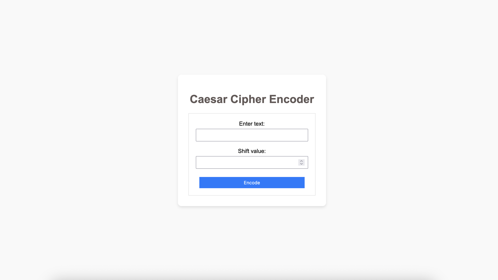

# ruby_projects
Lightweight Ruby/Sinatra Full-Stack Web App

First basic Ruby project through The Odin Project course. 

Created and completed caesar_cipher.rb first.

Then my next steps was to see if I could make it full stack.

I downloaded Sinatra as the framework to get my first basic full-stack app running. - app.rb

Then created index.erb to have a more compartmentalized structure to write out my HTML. views/index.erb

Next, in a public folder, created styles.css to stylize the page. public/styles.css

Linked all the files together through: 

  - Front-End HTML form, CSS and rendered result, served via index.erb

  - Back-End Sinatra server handling GET/POST requests

# Caesar Cipher App


 <!-- Replace with an actual image path or URL -->


## 📖 Project Overview


The **Caesar Cipher App** is a web application built with Ruby and Sinatra that allows users to encrypt and decrypt messages using the Caesar cipher technique. This classic cipher method involves shifting the letters in the plaintext by a fixed number, making it a fundamental example of encryption that is easy to implement and understand.


## ✨ Features


- Encrypt messages by applying a shift value to each letter.
- Decrypt previously encrypted messages back to their original form.
- User-friendly interface that simplifies the encryption and decryption process.
- Option to choose the shift value for customized encryption.


## 🛠️ Tech Stack


- **Frontend**: HTML, CSS
- **Backend**: Ruby, Sinatra
- **Database**: Not applicable (no database used)
- **Styling**: Custom styling with CSS


## 🚀 Getting Started


### 1️⃣ Clone the Repository


```sh
git clone https://github.com/jkimsuzuki/caesar_cipher_app-Ruby.Sinatra.git
cd caesar_cipher_app-Ruby.Sinatra
```


### 2️⃣ Install Dependencies


For this project, ensure you have Ruby installed on your machine. You can use Bundler to handle any dependencies:


```sh
bundle install
```


### 3️⃣ Start the Development Server


```sh
ruby app.rb
```


The app will be running on `http://localhost:4567`.


## 🔮 Future Improvements


- Implement a more complex encryption method for enhanced security.
- Add user authentication to save and manage users' encrypted messages.
- Expand functionality to include more cryptographic algorithms.
- Improve UI design for better user experience.


## 🤝 Contributing


Contributions are welcome! If you have ideas for improvements, feel free to fork the repo, make changes, and submit a pull request. Let's build something awesome together! 🚀


---


Made with ❤️ by [jkimsuzuki](https://github.com/jkimsuzuki)


